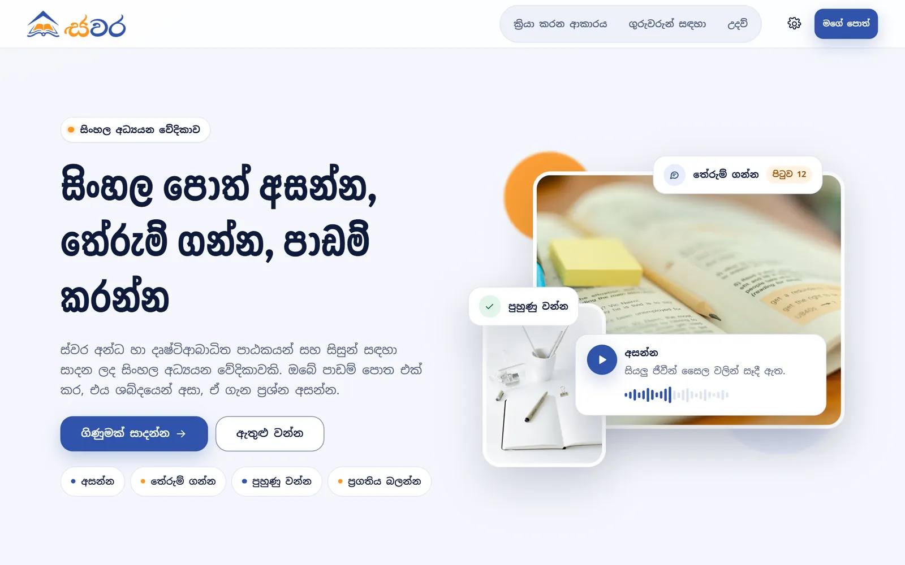
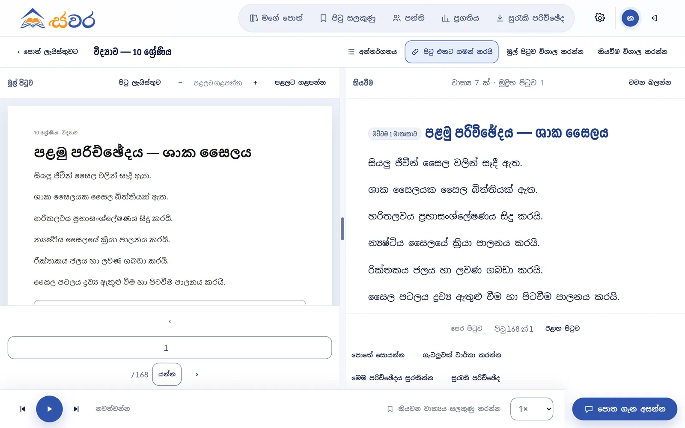
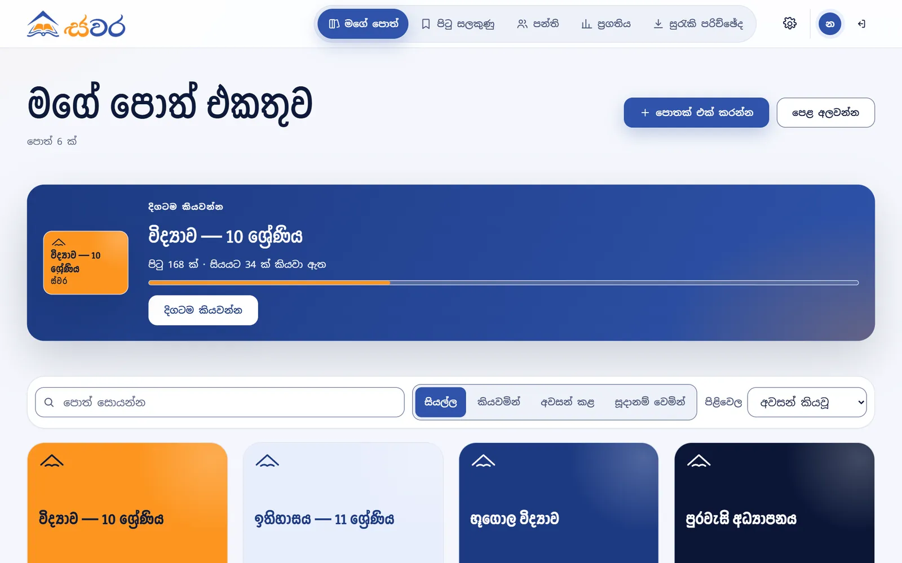
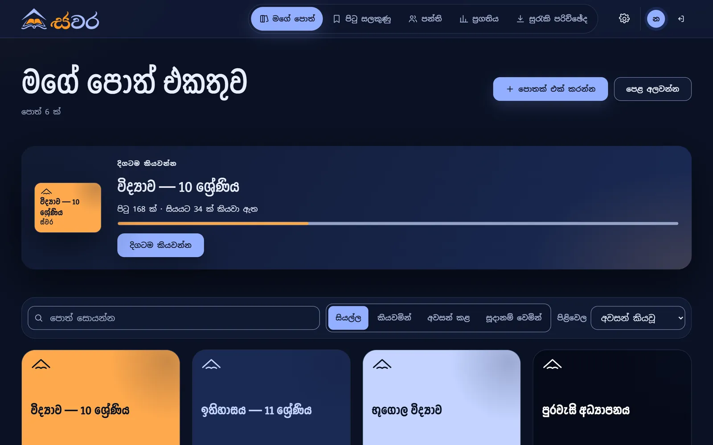
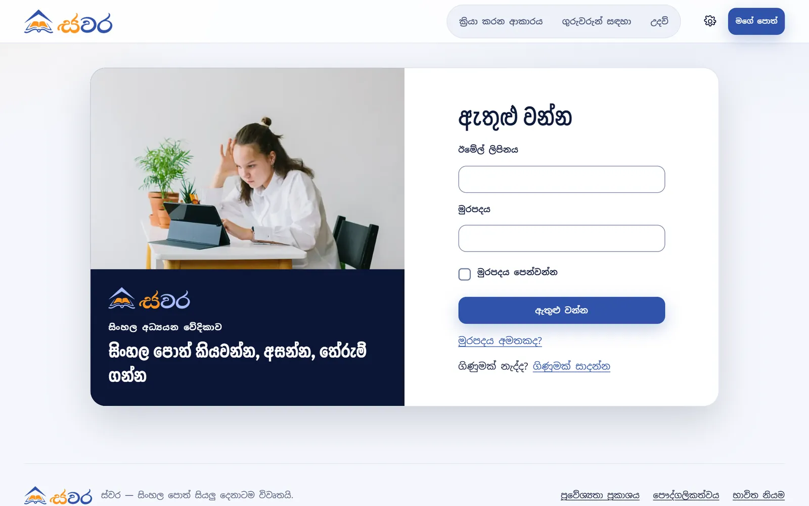
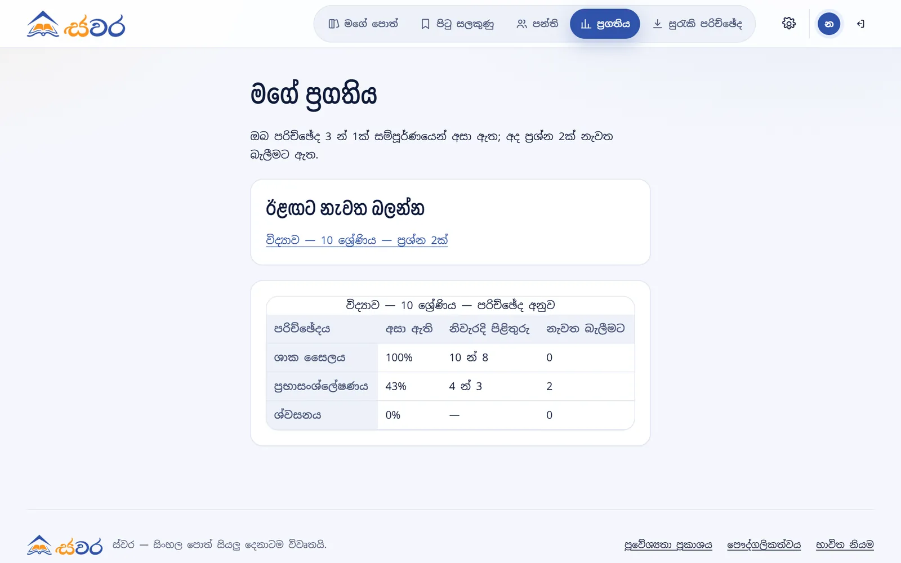
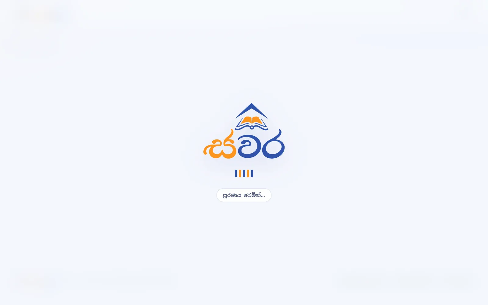
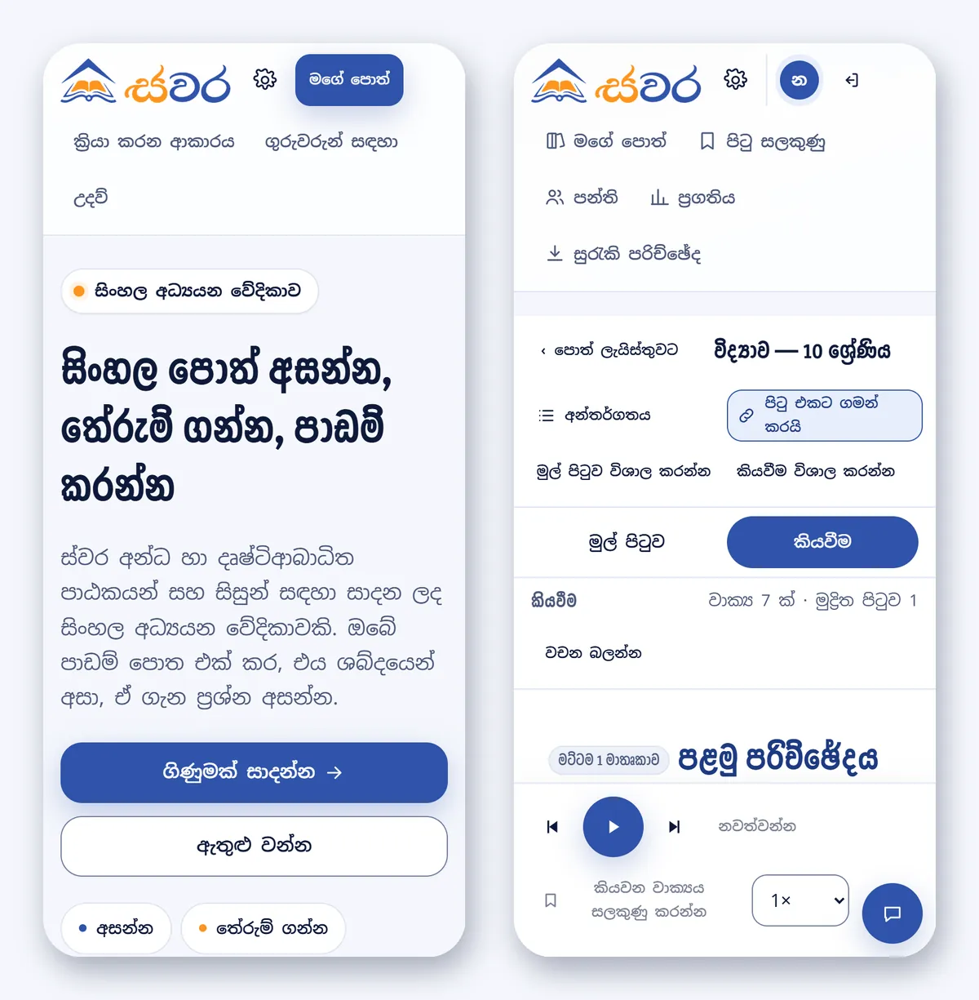
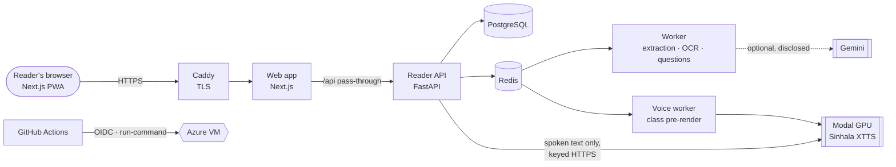

<p align="center">
  <picture>
    <source media="(prefers-color-scheme: dark)" srcset="apps/web/public/brand/swara-logo-dark.webp">
    
  </picture>
</p>

<h3 align="center">Hear, understand and study Sinhala books.</h3>

<p align="center">
  An accessible Sinhala study platform for blind and low-vision readers and students.<br>
  Listen to a textbook, ask about it, practise on it, and track your progress, independently.
</p>

<p align="center">
  <a href="https://github.com/DSEgrp18/Web-Page/actions/workflows/ci.yml"></a>
  <a href="https://github.com/DSEgrp18/Web-Page/actions/workflows/deploy-azure.yml"></a>
  
  
  <a href="LICENSE"></a>
</p>

<p align="center">
  <a href="https://swara.dpdns.org"><b>Staging site</b></a> ·
  <a href="docs/product-plan.md">Product plan</a> ·
  <a href="docs/remaining-work.md">What remains</a> ·
  <a href="CONTRIBUTING.md">Contributing</a>
</p>

<p align="center">
  
</p>

---

## The learning loop

Swara is built around one loop: **Listen → Understand → Practise → Track**. Each
step works with a keyboard and a screen reader, in Sinhala first.

### 🎧 Listen

- **Add a book** as a PDF, a Word file, a photograph of a page, or pasted text.
- **Hear it sentence by sentence** in a Sinhala voice: a fine-tuned XTTS-v2
  model running on a GPU. Each sentence is highlighted as it is read.
- **Stop anywhere and carry on later.** Your position is saved, and resuming
  never starts talking until you press play.
- **No gaps between sentences.** While one sentence plays, the next ones are
  made in parallel, and anything already made is cached so it is never made twice.
- **The original page beside the readable text**, as two resizable panels. On a
  phone they become tabs.
- **Speed control**, chapters and a table of contents, in-book search,
  bookmarks with notes, and whole chapters saved for **offline listening**.

### 💬 Understand

- **Ask a question about the book.** The answer comes from the book's own
  passages, with a link to the page it is on.
- **When the book has no answer, Swara says so** instead of inventing one, and
  it never makes up a citation.
- By default the answer is the book's own sentences. Optionally, a model writes
  a Sinhala answer from the retrieved passages, labelled as written.
- Summaries of a section are available too, also labelled and grounded in the book.

### ✍️ Practise

- **Fill-in-the-blank questions** made from the book's own sentences, about the
  terms the lesson keeps returning to, with real words from the book as options.
- **Model-drafted questions**, written by a model and then judged by a
  deterministic verifier. The quoted evidence must appear word for word in a cited
  passage, the right answer must be supported by it, and no distractor may be.
  A single failed check discards the question; it is never repaired.
- Questions reach a class only after a teacher approves them.

### 📈 Track

- The chapters you have heard, how you answered, and **spaced review**: the
  questions due today come back in Leitner boxes.

### 👩‍🏫 For teachers

- **Classes** with join codes. Students can be approved, removed and have their
  passwords reset.
- **Publish a book to a class** once it is reviewed and you have attested the
  right to share it. Its audio is **pre-rendered once** for every member.
- **Review flagged pages** and correct OCR text before students hear it.
- See **class progress** only from students who chose to share it; sharing is
  off by default.

## Screenshots

<table>
  <tr>
    <td width="50%"><br><sub><b>The reader.</b> The original page beside the readable text, with the player and the Ask button.</sub></td>
    <td width="50%"><br><sub><b>The library.</b> Continue where you left off; each book gets a cover in the brand's colours.</sub></td>
  </tr>
  <tr>
    <td><br><sub><b>Dark theme.</b> The whole palette is measured for contrast in both themes.</sub></td>
    <td><br><sub><b>Accounts.</b> Sign in, register and recover a password with a recovery code instead of email.</sub></td>
  </tr>
  <tr>
    <td><br><sub><b>Progress.</b> Chapters heard, answers given, and what to revise today.</sub></td>
    <td><br><sub><b>Loading.</b> The logo over the page blurred. Under reduced motion the bars stay still.</sub></td>
  </tr>
</table>

<p align="center">
  <br>
  <sub>On a phone: the front door, and the reader with the player pinned in reach of a thumb.</sub>
</p>

<sub>Screenshots use invented books and accounts.</sub>

## Built for accessibility

Accessibility here is a release requirement, not a feature.

- **Target: WCAG 2.2 AA.** Every control works from the keyboard, focus is
  always visible, and every control is at least 48 px.
- **Nothing speaks on its own.** There is no autoplay on load, on page change or
  on resume, so Swara never talks over a screen reader.
- **Sinhala first,** with an optional English interface. The book's text is
  always marked `lang="si"`, so screen readers pick the right voice.
- **Typography for Sinhala:** leading never below 1.5, and 1.9 for reading.
  Text sizes grow with zoom, and nothing scrolls sideways from 320 px up.
- **Measured, not assumed:** CI runs axe over every screen in both themes and both
  languages. Contrast must be decided for every node, and a test computes
  112 colour pairs from the design tokens.
- **Honest about gaps:** a page that cannot be read reliably is flagged, not
  narrated, and placeholder audio is labelled at every layer.

> **Not yet done:** no one has tested Swara with NVDA or TalkBack. CLAUDE.md
> treats that as a release blocker, and it is first on the list in
> [`docs/remaining-work.md`](docs/remaining-work.md).

## Technology

<table>
  <tr><th align="left">Voice</th><td>
    A <b>fine-tuned Sinhala XTTS-v2</b> checkpoint, served on a <b>Modal A10G GPU</b> behind one authenticated HTTPS endpoint, so the server never holds Modal account credentials.
    It can also run locally on CPU, or as a labelled placeholder tone for development.
    Text guards, the number reading and the cache key are computed on the server, and every clip's audio is checked on arrival (finite, not silent, not clipped, plausible length).
  </td></tr>
  <tr><th align="left">Sinhala text</th><td>
    A tested text front end: numbers, dates and decimals read in context (a heading's “1.1” is a section, not a decimal), the model's romaniser kept exactly, and segmentation within the model's measured limits.
  </td></tr>
  <tr><th align="left">Documents</th><td>
    PDF, DOCX and image extraction. Text in the legacy <b>FM-Abhaya</b> font is decoded with a vendored, hash-verified mapping, and garbled text is detected.
    Unreadable pages go to <b>Sinhala OCR</b> (Tesseract, or a TrOCR model).
    Optionally, a model infers page structure (headings, captions, lists), checked <b>character for character</b> against the extraction: one altered character and the page falls back to the deterministic path.
  </td></tr>
  <tr><th align="left">Retrieval</th><td>
    BM25 lexical, character-trigram dense and hybrid retrieval, chosen by configuration, with an evaluation harness in <code>evaluation/</code>. Retrieval is limited to documents the reader may see, and document text is treated as evidence, never as instructions.
  </td></tr>
  <tr><th align="left">Agents, bounded</th><td>
    <b>LangGraph</b> is used for one thing, drafting practice questions, and only in the Celery worker. Each run has limits on revisions, model calls and time, no tools, and no web access. Gemini is optional, disclosed in the privacy notice and in <code>/readiness</code>.
  </td></tr>
  <tr><th align="left">Web app</th><td>
    <b>Next.js 16</b>, <b>React 19</b> and TypeScript, as a progressive web app. A design system built from the logo, with every colour a token. Self-hosted Yaldevi, Noto Sans Sinhala and Plus Jakarta Sans. Light and dark themes.
  </td></tr>
  <tr><th align="left">Backend</th><td>
    <b>FastAPI</b>, <b>PostgreSQL</b>, <b>Celery</b> on <b>Redis</b>, and a separate voice worker that pre-renders class books.
    Sessions use httpOnly cookies with CSRF and Fetch-Metadata checks.
    Authorization is enforced in the store: anything a reader may not see is a 404.
  </td></tr>
  <tr><th align="left">Delivery</th><td>
    Docker Compose on an <b>Azure</b> VM behind <b>Caddy</b> (automatic HTTPS).
    <b>GitHub Actions</b> deploys every commit that passes CI on <code>main</code>. It signs in with <b>OIDC</b> (no stored secrets), deploys through Azure run-command (no open SSH), smoke-tests, and <b>rolls back automatically</b> on failure.
  </td></tr>
  <tr><th align="left">Quality gates</th><td>
    Vitest (500+ tests), pytest, Playwright with axe in Chromium, ruff, ESLint with the React rules, TypeScript strict mode, a CSS verifier (every class styled, every colour a token), contract checks, and a repository hygiene check that keeps weights, audio and documents out of Git.
  </td></tr>
</table>



## Status

The full list, with an owner for each item, is
[`docs/remaining-work.md`](docs/remaining-work.md). This README is corrected
as capabilities land, never written ahead of them.

| Area | State |
| --- | --- |
| Reader: library, two-panel reader, player, chapters, bookmarks, search, offline chapters | Working |
| Sinhala voice | **Running on a GPU** (Modal A10G, fp32): 1.1–1.4× real time per sentence, and 9 of 10 regression sentences pass the audio checks. The first sentence after five idle minutes waits about 45 s for a cold start. Half precision is not usable yet |
| Documents: PDF, DOCX, images, legacy fonts, OCR | Working. 97.4% of a real 168-page Grade 11 textbook is readable; what is not is flagged. OCR accuracy has **not** been measured |
| Study answers and summaries | Working, with citations and abstention. Retrieval and answer quality are **unmeasured** until the evaluation sets exist |
| Practice, review and teacher approval | Working. The better-questions work is in progress |
| Accounts, classes and class library | Working |
| Staging deployment | **Live** at [swara.dpdns.org](https://swara.dpdns.org): Azure, HTTPS, automatic deploys with rollback. Database backups, quotas on voice generation, and observability are **not in place yet** |
| Screen reader testing (NVDA, TalkBack) | **Not done.** A release blocker |
| Sinhala interface text | Awaiting native-speaker review |
| Evaluation and user study | The kit is in `evaluation/`; nothing has been measured yet, and the study needs ethics approval first |

## Run it

Docker Compose runs the whole reader: the web app, API, worker, PostgreSQL and
Redis, with a labelled placeholder voice. See [`infra/README.md`](infra/README.md)
for the secret it needs, the real-voice overlay, OCR, and the Windows `refresh`
script.

```bash
docker compose -f infra/docker-compose.yml up --build
```

To run the API and the web app outside Docker, see
[`services/api/README.md`](services/api/README.md) and
[`apps/web`](apps/web). For the Azure server and its deploy pipeline, see
[`infra/azure/README.md`](infra/azure/README.md); for the GPU voice, see
[`services/tts/deploy/README.md`](services/tts/deploy/README.md).

## Model assets

The Sinhala XTTS bundle is **not** in this repository and cannot be obtained
from it. The project owner supplies it out of band, and configuration locates it
at runtime. Checkpoints, speaker reference audio, uploaded documents and
generated audio never enter Git, and CI enforces this.

## Repository layout

```text
apps/web/            The reader interface (Next.js PWA): screens, player, design system
services/api/        Reader API: accounts, documents, audio, study answers, practice, classes
services/worker/     Extraction, FM-Abhaya decoding, OCR, segmentation, retrieval, question drafting
services/tts/        Sinhala text front end, synthesis adapters, and the Modal GPU deployment
evaluation/          Evaluation protocol, rubrics, draft consent forms and runners
data/legacy_fonts/   Vendored FM-Abhaya to Unicode mapping (MIT, hash-verified)
infra/               Dockerfiles, Compose files, and the Azure deploy script and runbook
browser-tests/       Playwright and axe tests driving the real interface
docs/                Product plan, remaining work, brand, UI guide, inference manifest
scripts/             Repository verification and local refresh scripts
.github/             CI, Azure deploy, code owners, issue and pull request templates
CLAUDE.md            The governing project specification
```

## Contributing

See [CONTRIBUTING.md](CONTRIBUTING.md) for branch naming, reviews and the
definition of done, and [CLAUDE.md](CLAUDE.md) for the governing specification.
Participation is covered by our [Code of Conduct](CODE_OF_CONDUCT.md), and
security or private-data reports go through [SECURITY.md](SECURITY.md).

## Licence

Different terms apply to different parts of this project. Read this before you
reuse any of it.

**The source code in this repository is MIT licensed.** See [LICENSE](LICENSE).

**Other parts carry their own terms:**

| Part | Terms |
| --- | --- |
| Vendored legacy-font data | MIT, from its upstream authors (akuruAI/Pandukabhaya, derived from UCSC Language Technology Research Laboratory research). See [data/legacy_fonts/LICENSE](data/legacy_fonts/LICENSE) and [its README](data/legacy_fonts/README.md) |
| Interface fonts | SIL Open Font License 1.1, each licence beside its font in [apps/web/src/app/fonts](apps/web/src/app/fonts) |
| Photographs | Pexels license. Sources and photographers are in [docs/brand/README.md](docs/brand/README.md) |

**The Sinhala XTTS model is not covered by the MIT licence, and is not
distributed here.** The underlying XTTS-v2 weights are published under the
Coqui Public Model Licence (CPML), which **restricts use to non-commercial
purposes**. Fine-tuning does not automatically remove those terms. Whether and
how CPML applies to this project's fine-tuned checkpoint **is not yet
resolved**, and must be settled before any commercial deployment. Permission to
use the speaker reference audio must also be confirmed before public release.

In short: the code is free to reuse, but running it with this project's voice is
not yet cleared for commercial use.
