# Swara architecture, in diagrams

How the system fits together, end to end, for an engineer joining the project.
Every diagram is Mermaid, so GitHub renders it in place. Where a diagram and
the code disagree, the code wins: each section names the files to check.

Things that are designed but not built are drawn with dashed lines and marked
**planned**. The phase plan and the reasons behind each decision are in
[`product-plan.md`](product-plan.md).

**Contents**

1. [System context](#1-system-context)
2. [Containers and runtime](#2-containers-and-runtime)
3. [Code modules](#3-code-modules)
4. [Uploading and preparing a book](#4-uploading-and-preparing-a-book)
5. [How one page becomes text](#5-how-one-page-becomes-text)
6. [Listening, and the audio cache](#6-listening-and-the-audio-cache)
7. [Asking a question about the book](#7-asking-a-question-about-the-book)
8. [Sign-in, sessions and CSRF](#8-sign-in-sessions-and-csrf)
9. [Who may see what](#9-who-may-see-what)
10. [Data model](#10-data-model)
11. [Classes, sharing and pre-rendering](#11-classes-sharing-and-pre-rendering)
12. [Practice questions](#12-practice-questions)
13. [State machines](#13-state-machines)
14. [The web app](#14-the-web-app)
15. [One sentence, four texts](#15-one-sentence-four-texts)
16. [Deployment and CI](#16-deployment-and-ci)

---

## 1. System context

Who uses Swara, and what it talks to. Every external call is optional and off
by default; without them the reader still extracts, narrates, answers from the
book's own sentences and makes fill-in-the-blank questions.

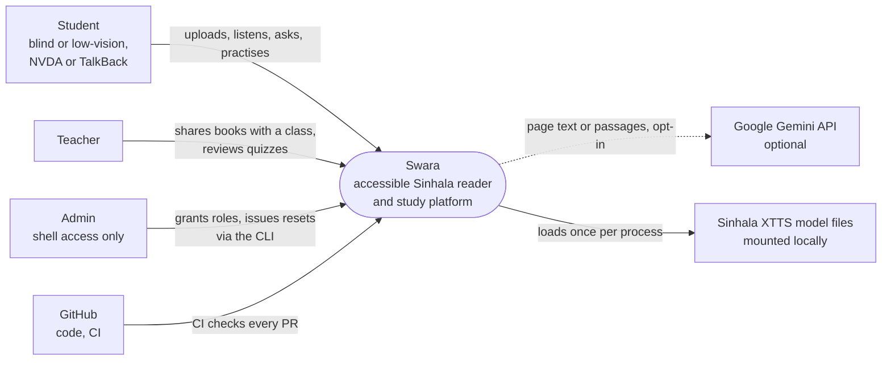
```mermaid
flowchart LR
    student["Student<br/>blind or low-vision,<br/>NVDA or TalkBack"]
    teacher["Teacher"]
    admin["Admin<br/>shell access only"]
    swara(["Swara<br/>accessible Sinhala reader<br/>and study platform"])
    gemini["Google Gemini API<br/>optional"]
    model["Sinhala XTTS model files<br/>mounted locally"]
    github["GitHub<br/>code, CI"]

    student -- "uploads, listens, asks, practises" --> swara
    teacher -- "shares books with a class,<br/>reviews quizzes" --> swara
    admin -- "grants roles, issues resets<br/>via the CLI" --> swara
    swara -. "page text or passages, opt-in" .-> gemini
    swara -- "loads once per process" --> model
    github -- "CI checks every PR" --> swara
```

## 2. Containers and runtime

What runs where. The browser only ever talks to its own origin: the Next.js
server forwards `/api/*` to FastAPI, so there is no CORS and the session cookie
never leaves the site. Check against `infra/docker-compose.yml`.

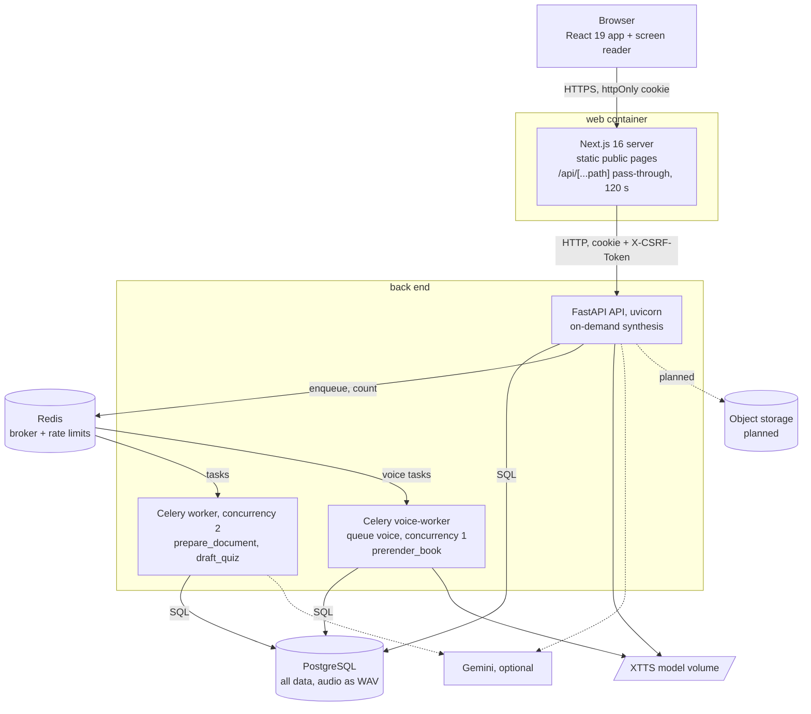
```mermaid
flowchart TB
    browser["Browser<br/>React 19 app + screen reader"]
    subgraph web["web container"]
        next["Next.js 16 server<br/>static public pages<br/>/api/[...path] pass-through, 120 s"]
    end
    subgraph backend["back end"]
        api["FastAPI API, uvicorn<br/>on-demand synthesis"]
        worker["Celery worker, concurrency 2<br/>prepare_document, draft_quiz"]
        voice["Celery voice-worker<br/>queue voice, concurrency 1<br/>prerender_book"]
    end
    pg[("PostgreSQL<br/>all data, audio as WAV")]
    redis[("Redis<br/>broker + rate limits")]
    model[/"XTTS model volume"/]
    gemini["Gemini, optional"]
    s3[("Object storage<br/>planned")]

    browser -- "HTTPS, httpOnly cookie" --> next
    next -- "HTTP, cookie + X-CSRF-Token" --> api
    api -- SQL --> pg
    api -- "enqueue, count" --> redis
    redis -- tasks --> worker
    redis -- "voice tasks" --> voice
    worker -- SQL --> pg
    voice -- SQL --> pg
    api --> model
    voice --> model
    api -.-> gemini
    worker -.-> gemini
    api -. planned .-> s3
```

## 3. Code modules

The repository is one application back end with separate workers, not
microservices. The API imports the worker and TTS packages directly: no network
hop. The web app reaches the API only over HTTP, through one client class, and
`verify-contract.mjs` holds its hand-written types to the API's OpenAPI schema.

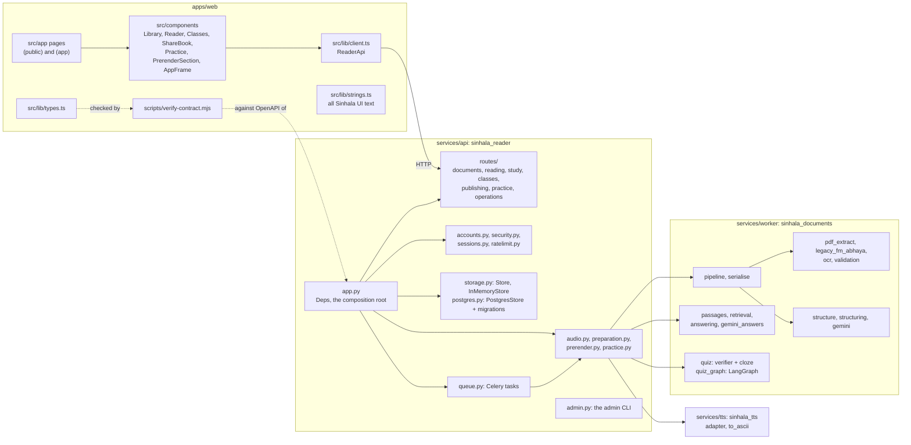
```mermaid
flowchart LR
    subgraph webapp["apps/web"]
        pages["src/app pages<br/>(public) and (app)"]
        comps["src/components<br/>Library, Reader, Classes, ShareBook,<br/>Practice, PrerenderSection, AppFrame"]
        client["src/lib/client.ts<br/>ReaderApi"]
        types["src/lib/types.ts"]
        strings["src/lib/strings.ts<br/>all Sinhala UI text"]
        contract["scripts/verify-contract.mjs"]
    end
    subgraph apipkg["services/api: sinhala_reader"]
        app["app.py<br/>Deps, the composition root"]
        routes["routes/<br/>documents, reading, study, classes,<br/>publishing, practice, operations"]
        acct["accounts.py, security.py,<br/>sessions.py, ratelimit.py"]
        store["storage.py: Store, InMemoryStore<br/>postgres.py: PostgresStore + migrations"]
        svc["audio.py, preparation.py,<br/>prerender.py, practice.py"]
        queue["queue.py: Celery tasks"]
        admincli["admin.py: the admin CLI"]
    end
    subgraph workerpkg["services/worker: sinhala_documents"]
        extract["pdf_extract, legacy_fm_abhaya,<br/>ocr, validation"]
        struct["structure, structuring, gemini"]
        pipe["pipeline, serialise"]
        rag["passages, retrieval,<br/>answering, gemini_answers"]
        quiz["quiz: verifier + cloze<br/>quiz_graph: LangGraph"]
    end
    tts["services/tts: sinhala_tts<br/>adapter, to_ascii"]

    pages --> comps --> client
    client -- HTTP --> routes
    types -. checked by .-> contract
    contract -. "against OpenAPI of" .-> app
    app --> routes & acct & store & svc & queue
    svc --> pipe & rag & quiz & tts
    queue --> svc
    pipe --> extract & struct
```

## 4. Uploading and preparing a book

Preparation runs in the worker, never in the request. A job holds a lease and
heartbeats; a job whose process died is failed by the reaper, and a failure that
could succeed again can be retried as a new job. Check against
`services/api/src/sinhala_reader/preparation.py` and
`services/worker/src/sinhala_documents/pipeline.py`.

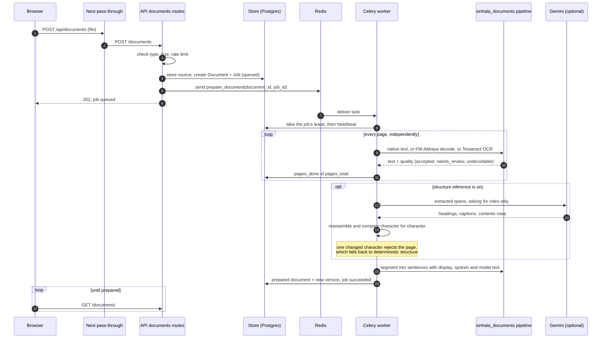
```mermaid
sequenceDiagram
    autonumber
    participant B as Browser
    participant N as Next pass-through
    participant A as API documents routes
    participant S as Store (Postgres)
    participant R as Redis
    participant W as Celery worker
    participant P as sinhala_documents pipeline
    participant G as Gemini (optional)

    B->>N: POST /api/documents (file)
    N->>A: POST /documents
    A->>A: check type, size, rate limit
    A->>S: store source, create Document + Job (queued)
    A->>R: send prepare_document(document_id, job_id)
    A-->>B: 202, job queued
    R->>W: deliver task
    W->>S: take the job's lease, then heartbeat
    loop every page, independently
        W->>P: native text, or FM-Abhaya decode, or Tesseract OCR
        P-->>W: text + quality (accepted, needs_review, undecodable)
        W->>S: pages_done of pages_total
    end
    opt structure inference is on
        W->>G: extracted spans, asking for roles only
        G-->>W: headings, captions, contents rows
        W->>W: reassemble and compare character for character
        Note over W: one changed character rejects the page,<br/>which falls back to deterministic structure
    end
    W->>P: segment into sentences with display, spoken and model text
    W->>S: prepared document + new version, job succeeded
    loop until prepared
        B->>A: GET /documents
    end
```

## 5. How one page becomes text

Each page is decided on its own: a book can mix typed pages, legacy-font pages
and scans. How the text was got (native, legacy, OCR) is kept separate from how
far it can be trusted (the quality state).

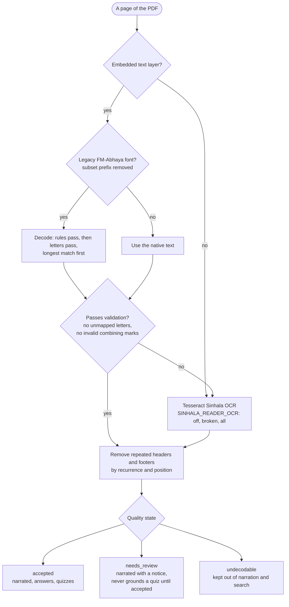
```mermaid
flowchart TD
    start(["A page of the PDF"]) --> layer{"Embedded text layer?"}
    layer -- yes --> legacy{"Legacy FM-Abhaya font?<br/>subset prefix removed"}
    legacy -- yes --> decode["Decode: rules pass, then letters pass,<br/>longest match first"]
    legacy -- no --> native["Use the native text"]
    decode --> valid{"Passes validation?<br/>no unmapped letters,<br/>no invalid combining marks"}
    native --> valid
    layer -- no --> ocr["Tesseract Sinhala OCR<br/>SINHALA_READER_OCR: off, broken, all"]
    valid -- no --> ocr
    valid -- yes --> clean["Remove repeated headers and footers<br/>by recurrence and position"]
    ocr --> clean
    clean --> q{"Quality state"}
    q --> accepted["accepted<br/>narrated, answers, quizzes"]
    q --> review["needs_review<br/>narrated with a notice,<br/>never grounds a quiz until accepted"]
    q --> bad["undecodable<br/>kept out of narration and search"]
```

## 6. Listening, and the audio cache

Audio is made the first time a sentence is asked for, then read from the cache.
It belongs to the book, not the listener, so a class shares one recording. A
per-key lock stops playback and prefetch making the same sentence twice. Check
against `services/api/src/sinhala_reader/audio.py` and `routes/reading.py`.

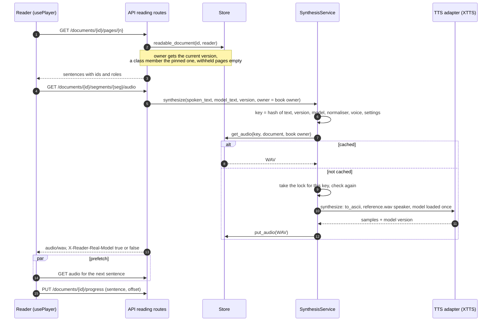
```mermaid
sequenceDiagram
    autonumber
    participant U as Reader (usePlayer)
    participant A as API reading routes
    participant S as Store
    participant Y as SynthesisService
    participant T as TTS adapter (XTTS)

    U->>A: GET /documents/{id}/pages/{n}
    A->>S: readable_document(id, reader)
    Note over A,S: owner gets the current version,<br/>a class member the pinned one, withheld pages empty
    A-->>U: sentences with ids and roles
    U->>A: GET /documents/{id}/segments/{seg}/audio
    A->>Y: synthesize(spoken_text, model_text, version, owner = book owner)
    Y->>Y: key = hash of text, version, model, normaliser, voice, settings
    Y->>S: get_audio(key, document, book owner)
    alt cached
        S-->>Y: WAV
    else not cached
        Y->>Y: take the lock for this key, check again
        Y->>T: synthesize: to_ascii, reference.wav speaker, model loaded once
        T-->>Y: samples + model version
        Y->>S: put_audio(WAV)
    end
    A-->>U: audio/wav, X-Reader-Real-Model true or false
    par prefetch
        U->>A: GET audio for the next sentence
    end
    U->>A: PUT /documents/{id}/progress (sentence, offset)
```

## 7. Asking a question about the book

Search happens only inside what this reader may read, checked before anything
is searched. The answer is the book's own sentence by default; a generated
answer is labelled as such. When nothing matches, the reader is told there is no
answer rather than given a guess.

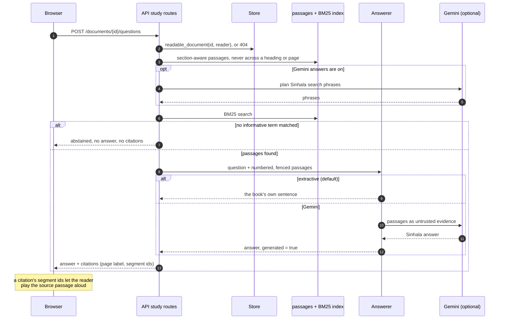
```mermaid
sequenceDiagram
    autonumber
    participant B as Browser
    participant A as API study routes
    participant S as Store
    participant X as passages + BM25 index
    participant Q as Answerer
    participant G as Gemini (optional)

    B->>A: POST /documents/{id}/questions
    A->>S: readable_document(id, reader), or 404
    A->>X: section-aware passages, never across a heading or page
    opt Gemini answers are on
        A->>G: plan Sinhala search phrases
        G-->>A: phrases
    end
    A->>X: BM25 search
    alt no informative term matched
        A-->>B: abstained, no answer, no citations
    else passages found
        A->>Q: question + numbered, fenced passages
        alt extractive (default)
            Q-->>A: the book's own sentence
        else Gemini
            Q->>G: passages as untrusted evidence
            G-->>Q: Sinhala answer
            Q-->>A: answer, generated = true
        end
        A-->>B: answer + citations (page label, segment ids)
    end
    Note over B: a citation's segment ids let the reader<br/>play the source passage aloud
```

## 8. Sign-in, sessions and CSRF

The session token lives in an httpOnly cookie that page scripts cannot read.
Changes also need a CSRF token and are refused when the browser says another
site sent them. There is no email: recovery is by codes. Check against
`accounts.py`, `security.py` and `sessions.py`.

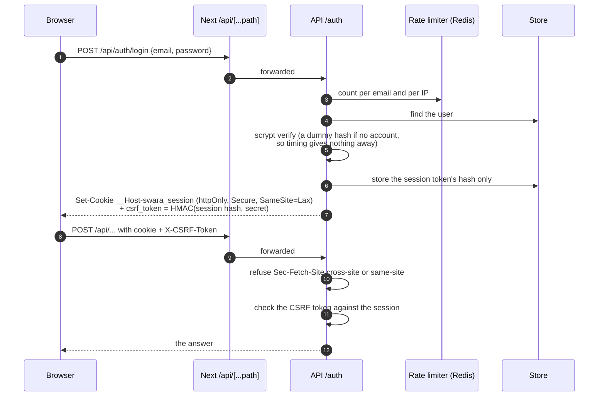
```mermaid
sequenceDiagram
    autonumber
    participant B as Browser
    participant N as Next /api/[...path]
    participant A as API /auth
    participant L as Rate limiter (Redis)
    participant S as Store

    B->>N: POST /api/auth/login {email, password}
    N->>A: forwarded
    A->>L: count per email and per IP
    A->>S: find the user
    A->>A: scrypt verify (a dummy hash if no account,<br/>so timing gives nothing away)
    A->>S: store the session token's hash only
    A-->>B: Set-Cookie __Host-swara_session (httpOnly, Secure, SameSite=Lax)<br/>+ csrf_token = HMAC(session hash, secret)
    B->>N: POST /api/... with cookie + X-CSRF-Token
    N->>A: forwarded
    A->>A: refuse Sec-Fetch-Site cross-site or same-site
    A->>A: check the CSRF token against the session
    A-->>B: the answer
```

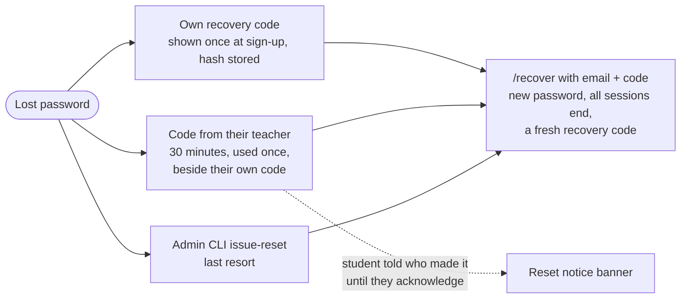
```mermaid
flowchart LR
    lost(["Lost password"]) --> own["Own recovery code<br/>shown once at sign-up, hash stored"]
    lost --> teach["Code from their teacher<br/>30 minutes, used once,<br/>beside their own code"]
    lost --> cli["Admin CLI issue-reset<br/>last resort"]
    own --> rec["/recover with email + code<br/>new password, all sessions end,<br/>a fresh recovery code"]
    teach --> rec
    cli --> rec
    teach -. "student told who made it<br/>until they acknowledge" .-> notice["Reset notice banner"]
```

## 9. Who may see what

One rule, enforced in the store rather than in each route: `Store.readable_document()`
and `Store.quiz_for()`. Anything a reader may not see answers 404, never 403, so
nobody learns that a private book exists. `tests/test_access_matrix.py` checks
seven actors (teacher, active, pending, removed, other_class, stranger, admin)
against three books and every document route, on both stores, as a release gate.

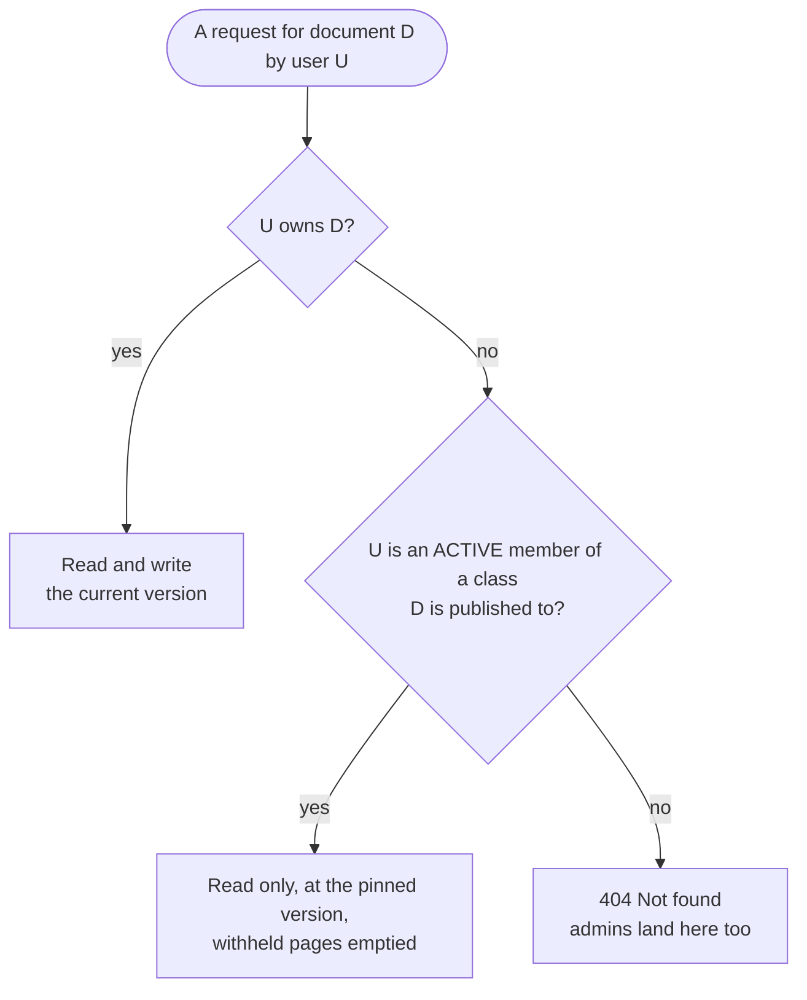
```mermaid
flowchart TD
    req(["A request for document D by user U"]) --> owner{"U owns D?"}
    owner -- yes --> full["Read and write<br/>the current version"]
    owner -- no --> member{"U is an ACTIVE member of a class<br/>D is published to?"}
    member -- yes --> read["Read only, at the pinned version,<br/>withheld pages emptied"]
    member -- no --> nf["404 Not found<br/>admins land here too"]
```

| Action                                                                  | Owner | Active class member | Anyone else |
| ----------------------------------------------------------------------- | ----- | ------------------- | ----------- |
| Pages, audio, questions, bookmarks, progress, personal quizzes          | yes   | yes, pinned version | 404         |
| Rename, delete, retry, review pages, publish, pre-render, class quizzes | yes   | 404                 | 404         |

## 10. Data model

The tables, as created by the migrations in
`services/api/src/sinhala_reader/postgres.py`. Only the columns that explain the
relationships are shown. Deleting a document or a user cascades to everything
derived from it.

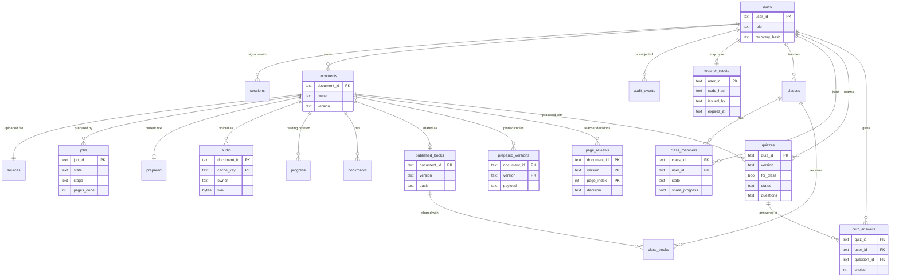
```mermaid
erDiagram
    users ||--o{ sessions : "signs in with"
    users ||--o{ documents : owns
    users ||--o{ audit_events : "is subject of"
    users ||--o| teacher_resets : "may have"
    users ||--o{ classes : teaches
    users ||--o{ class_members : joins
    classes ||--o{ class_members : has
    documents ||--|| sources : "uploaded file"
    documents ||--o{ jobs : "prepared by"
    documents ||--o| prepared : "current text"
    documents ||--o{ audio : "voiced as"
    documents ||--o{ progress : "reading position"
    documents ||--o{ bookmarks : has
    documents ||--o| published_books : "shared as"
    documents ||--o{ prepared_versions : "pinned copies"
    documents ||--o{ page_reviews : "teacher decisions"
    published_books ||--o{ class_books : "shared with"
    classes ||--o{ class_books : receives
    documents ||--o{ quizzes : "practised with"
    users ||--o{ quizzes : makes
    quizzes ||--o{ quiz_answers : "answered in"
    users ||--o{ quiz_answers : gives

    users {
        text user_id PK
        text role
        text recovery_hash
    }
    documents {
        text document_id PK
        text owner
        text version
    }
    jobs {
        text job_id PK
        text state
        text stage
        int pages_done
    }
    audio {
        text document_id PK
        text cache_key PK
        text owner
        bytea wav
    }
    class_members {
        text class_id PK
        text user_id PK
        text state
        bool share_progress
    }
    published_books {
        text document_id PK
        text version
        text basis
    }
    prepared_versions {
        text document_id PK
        text version PK
        text payload
    }
    page_reviews {
        text document_id PK
        text version PK
        int page_index PK
        text decision
    }
    teacher_resets {
        text user_id PK
        text code_hash
        text issued_by
        text expires_at
    }
    quizzes {
        text quiz_id PK
        text version
        bool for_class
        text status
        text questions
    }
    quiz_answers {
        text quiz_id PK
        text user_id PK
        text question_id PK
        int choice
    }
```

`teacher_invites` (single-use teacher codes) stands alone and is not drawn.

## 11. Classes, sharing and pre-rendering

The teacher's side of Phase 2: a class joined by code and let in by the
teacher, a book shared at a pinned version after its flagged pages are decided,
and its audio voiced once for everyone.

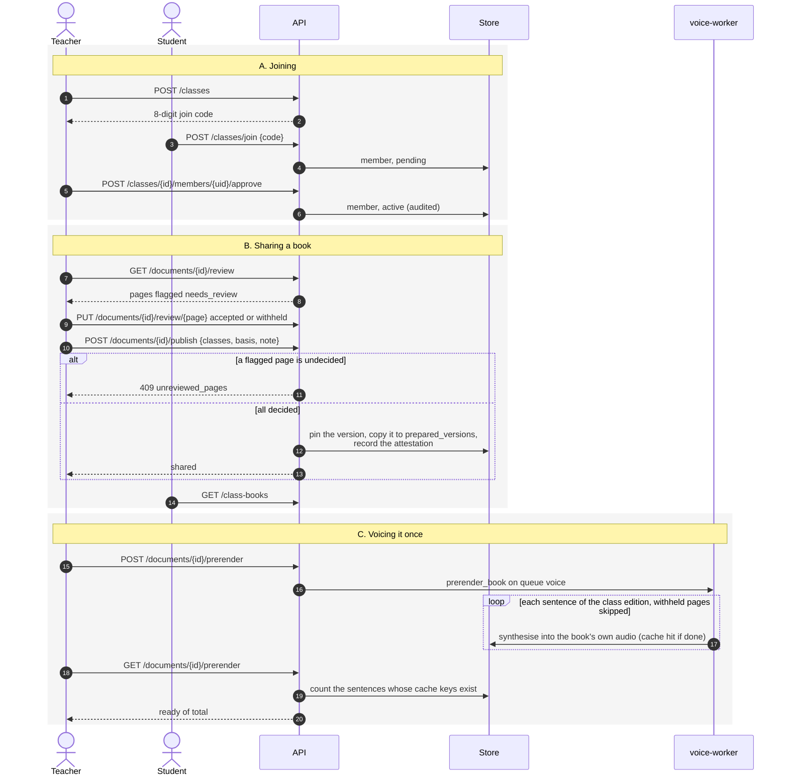
```mermaid
sequenceDiagram
    autonumber
    actor T as Teacher
    actor St as Student
    participant A as API
    participant S as Store
    participant V as voice-worker

    rect rgba(128,128,128,0.08)
    Note over T,S: A. Joining
    T->>A: POST /classes
    A-->>T: 8-digit join code
    St->>A: POST /classes/join {code}
    A->>S: member, pending
    T->>A: POST /classes/{id}/members/{uid}/approve
    A->>S: member, active (audited)
    end

    rect rgba(128,128,128,0.08)
    Note over T,S: B. Sharing a book
    T->>A: GET /documents/{id}/review
    A-->>T: pages flagged needs_review
    T->>A: PUT /documents/{id}/review/{page} accepted or withheld
    T->>A: POST /documents/{id}/publish {classes, basis, note}
    alt a flagged page is undecided
        A-->>T: 409 unreviewed_pages
    else all decided
        A->>S: pin the version, copy it to prepared_versions,<br/>record the attestation
        A-->>T: shared
    end
    St->>A: GET /class-books
    end

    rect rgba(128,128,128,0.08)
    Note over T,V: C. Voicing it once
    T->>A: POST /documents/{id}/prerender
    A->>V: prerender_book on queue voice
    loop each sentence of the class edition, withheld pages skipped
        V->>S: synthesise into the book's own audio (cache hit if done)
    end
    T->>A: GET /documents/{id}/prerender
    A->>S: count the sentences whose cache keys exist
    A-->>T: ready of total
    end
```

## 12. Practice questions

Two generators, one judge. Fill-in-the-blank needs no model and runs in the
request. Model drafting runs only in the Celery worker, is bounded, and is off
unless `SINHALA_READER_QUIZ=graph`. Every candidate passes the same verifier or
is thrown away. Check against `services/worker/src/sinhala_documents/quiz.py`,
`quiz_graph.py` and `services/api/src/sinhala_reader/practice.py`.

```mermaid
flowchart TD
    req(["POST /documents/{id}/quizzes"]) --> src["Question sources:<br/>passages on accepted pages only,<br/>prose sentences only"]
    src --> gen{"generator"}
    gen -- cloze --> cloze["Blank each sentence's rarest term, BM25 IDF<br/>3 distractors of similar length and ending<br/>seeded shuffle"]
    cloze --> ver{"verify()"}
    ver -- fails --> drop["Discarded, never repaired"]
    ver -- passes --> kind{"for the class?"}
    kind -- no --> pub["published, personal"]
    kind -- yes --> draft["draft"]
    gen -- graph --> gating["quiz stored as generating<br/>Celery draft_quiz"]
    gating --> graph["LangGraph loop in the worker"]
    graph -- "provider failed or<br/>nothing survived" --> failed["failed<br/>reader offered cloze as a choice"]
    graph -- "verified questions" --> kind
    draft --> reviewq["Teacher removes questions, never edits"]
    reviewq --> publish["POST publish, audited"]
    publish --> classv["Visible to active class members"]
```

The drafting loop and its bounds: 16 model calls, 240 seconds, 2 redrafts per
passage, recursion limit 50, target 5 questions. The model's blind check may
reject a question; it can never accept one.

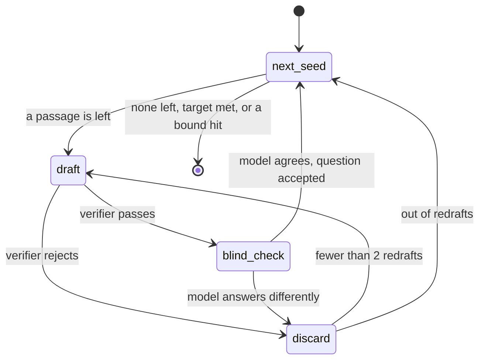
```mermaid
stateDiagram-v2
    [*] --> next_seed
    next_seed --> draft: a passage is left
    next_seed --> [*]: none left, target met, or a bound hit
    draft --> discard: verifier rejects
    draft --> blind_check: verifier passes
    blind_check --> discard: model answers differently
    blind_check --> next_seed: model agrees, question accepted
    discard --> draft: fewer than 2 redrafts
    discard --> next_seed: out of redrafts
```

| Verifier rejection code                                                | Means                                                   |
| ---------------------------------------------------------------------- | ------------------------------------------------------- |
| `unknown_passage`                                                      | cites a passage it was not given                        |
| `page_not_accepted`                                                    | the passage's page needs review or was withheld         |
| `empty`, `too_few_options`, `options_not_distinct`, `bad_answer_index` | malformed question                                      |
| `quote_not_in_passage`                                                 | the evidence is not the book's words, letter for letter |
| `answer_not_in_quote`                                                  | the evidence does not support the answer                |
| `distractor_in_quote`                                                  | the evidence supports a wrong option too                |
| `answer_in_question`                                                   | the question gives the answer away                      |

## 13. State machines

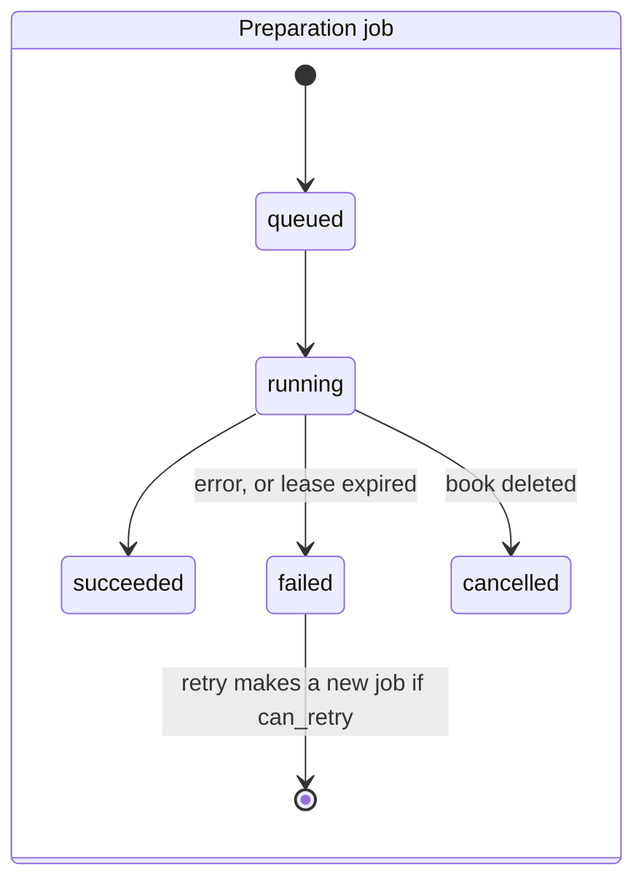
```mermaid
stateDiagram-v2
    direction LR
    state "Preparation job" as job {
        [*] --> queued
        queued --> running
        running --> succeeded
        running --> failed: error, or lease expired
        running --> cancelled: book deleted
        failed --> [*]: retry makes a new job if can_retry
    }
```

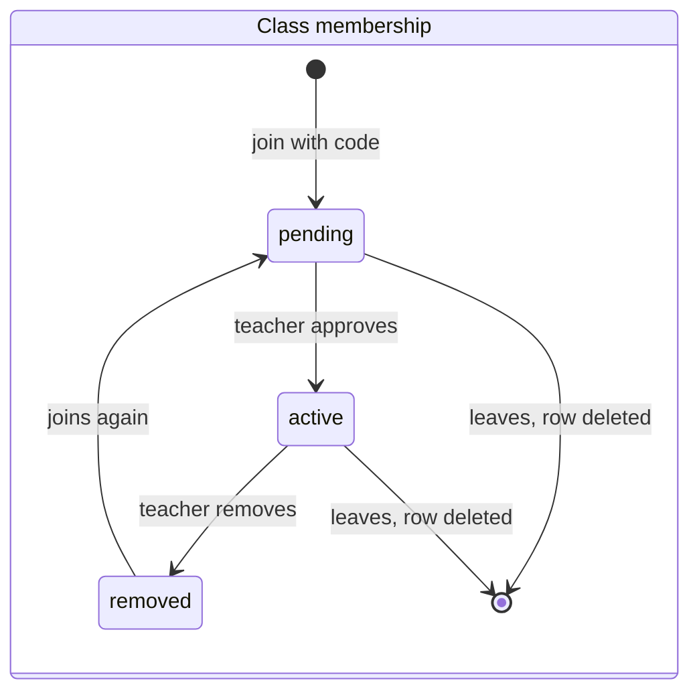
```mermaid
stateDiagram-v2
    direction LR
    state "Class membership" as m {
        [*] --> pending: join with code
        pending --> active: teacher approves
        active --> removed: teacher removes
        removed --> pending: joins again
        pending --> [*]: leaves, row deleted
        active --> [*]: leaves, row deleted
    }
```

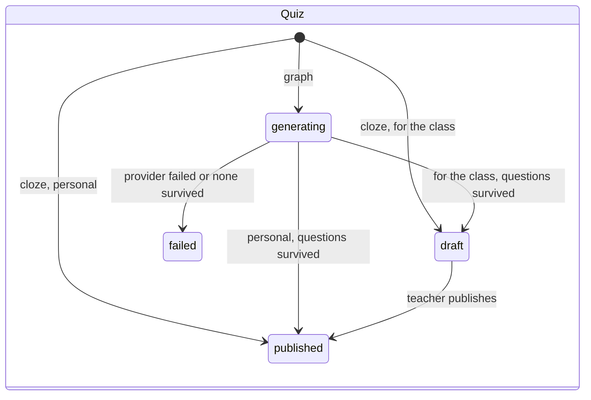
```mermaid
stateDiagram-v2
    direction LR
    state "Quiz" as q {
        [*] --> published: cloze, personal
        [*] --> draft: cloze, for the class
        [*] --> generating: graph
        generating --> published: personal, questions survived
        generating --> draft: for the class, questions survived
        generating --> failed: provider failed or none survived
        draft --> published: teacher publishes
    }
```

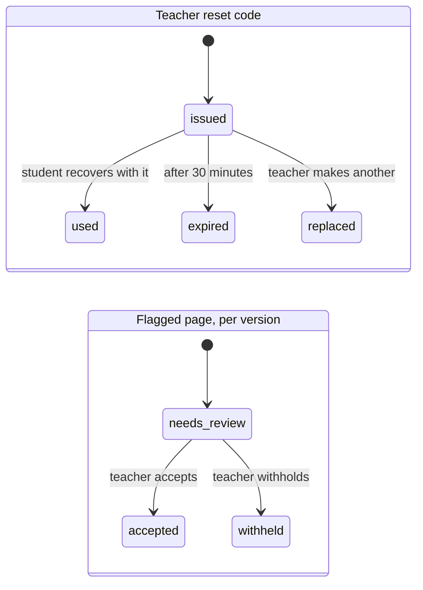
```mermaid
stateDiagram-v2
    direction LR
    state "Teacher reset code" as r {
        [*] --> issued
        issued --> used: student recovers with it
        issued --> expired: after 30 minutes
        issued --> replaced: teacher makes another
    }
    state "Flagged page, per version" as p {
        [*] --> needs_review
        needs_review --> accepted: teacher accepts
        needs_review --> withheld: teacher withholds
    }
```

## 14. The web app

Public pages are static; the app pages sit behind a session gate in `AppFrame`.
Every screen reaches the API through one client, `ReaderApi`, which the
providers create once. Tests replace `fetch` with `FakeServer` so the client
itself is under test.

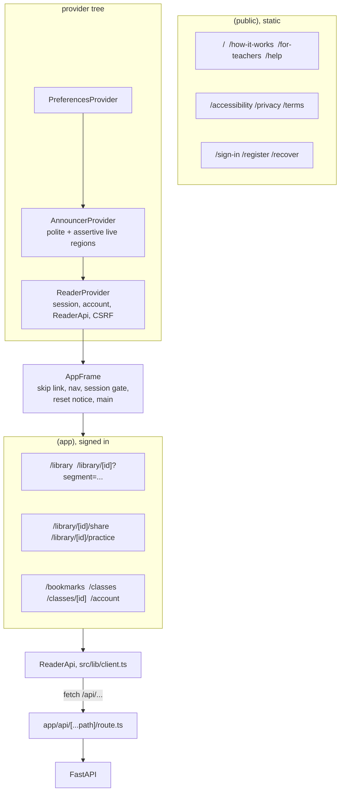
```mermaid
flowchart TB
    subgraph public["(public), static"]
        p1["/  /how-it-works  /for-teachers  /help"]
        p2["/accessibility  /privacy  /terms"]
        p3["/sign-in  /register  /recover"]
    end
    subgraph appg["(app), signed in"]
        a1["/library  /library/[id]?segment=..."]
        a2["/library/[id]/share  /library/[id]/practice"]
        a3["/bookmarks  /classes  /classes/[id]  /account"]
    end
    subgraph providers["provider tree"]
        pp["PreferencesProvider"] --> an["AnnouncerProvider<br/>polite + assertive live regions"] --> rp["ReaderProvider<br/>session, account, ReaderApi, CSRF"]
    end
    frame["AppFrame<br/>skip link, nav, session gate,<br/>reset notice, main"]
    rp --> frame --> appg
    appg --> api["ReaderApi, src/lib/client.ts"]
    api -- "fetch /api/..." --> pass["app/api/[...path]/route.ts"]
    pass --> fastapi["FastAPI"]
```

## 15. One sentence, four texts

Read mode never rewrites the book's words. The words are extracted once; what
changes between forms is only what the speech engine needs. A model may infer
structure (roles, reading order), never words.

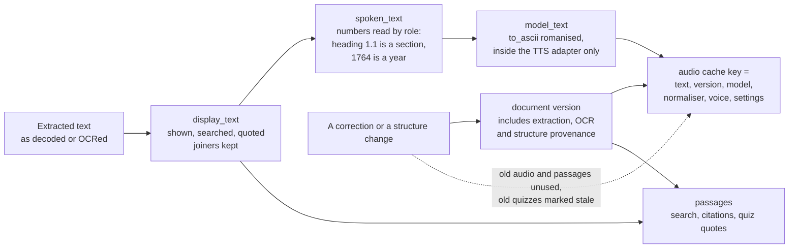
```mermaid
flowchart LR
    raw["Extracted text<br/>as decoded or OCRed"] --> display["display_text<br/>shown, searched, quoted<br/>joiners kept"]
    display --> spoken["spoken_text<br/>numbers read by role:<br/>heading 1.1 is a section,<br/>1764 is a year"]
    spoken --> modelt["model_text<br/>to_ascii romanised,<br/>inside the TTS adapter only"]
    display --> passages["passages<br/>search, citations, quiz quotes"]
    modelt --> key["audio cache key =<br/>text, version, model,<br/>normaliser, voice, settings"]
    version["document version<br/>includes extraction, OCR<br/>and structure provenance"] --> key
    version --> passages
    fix["A correction or a structure change"] --> version
    fix -. "old audio and passages unused,<br/>old quizzes marked stale" .-> key
```

## 16. Deployment and CI

Local and single-host deployment is Docker Compose. Staging, production and
object storage are planned.

```mermaid
flowchart LR
    subgraph compose["infra/docker-compose.yml"]
        web["web :3000"] --> api["api :8000"]
        api --> pg[("postgres")]
        api --> redis[("redis")]
        worker["worker"] --> pg
        voice["voice-worker<br/>extends worker, -Q voice"] --> pg
        redis --> worker
        redis --> voice
    end
    models[/"models/xtts_si_female<br/>mounted, never in Git"/] --> api
    models --> voice
    env["switches: SINHALA_READER_TTS, _OCR,<br/>_STRUCTURE, _ANSWERS, _QUIZ"] -.-> api
    staging["staging and production<br/>planned"]
    compose -. planned .-> staging
```

Every pull request runs these checks; `ci` is the one required check that
depends on all the rest, so a skipped job cannot pass for a green one.

```mermaid
flowchart LR
    branch["task branch<br/>feat/..., fix/..., docs/..."] --> pr["pull request"]
    pr --> jobs
    subgraph jobs["GitHub Actions"]
        j1["Reader API<br/>ruff, pytest, Postgres run that must not skip,<br/>OpenAPI contract"]
        j2["Reader UI<br/>lint, tsc, prettier, verify:css, vitest, build"]
        j3["Reader browser<br/>Playwright + axe, both themes"]
        j4["Document extraction"]
        j5["TTS text front end"]
        j6["api and voice images,<br/>fully pinned"]
        j7["repository hygiene,<br/>shell scripts, vendored assets"]
    end
    jobs --> ci{"ci aggregate"}
    ci -- green --> review["human review"]
    review --> merge["rebase-merge to protected main"]
```
